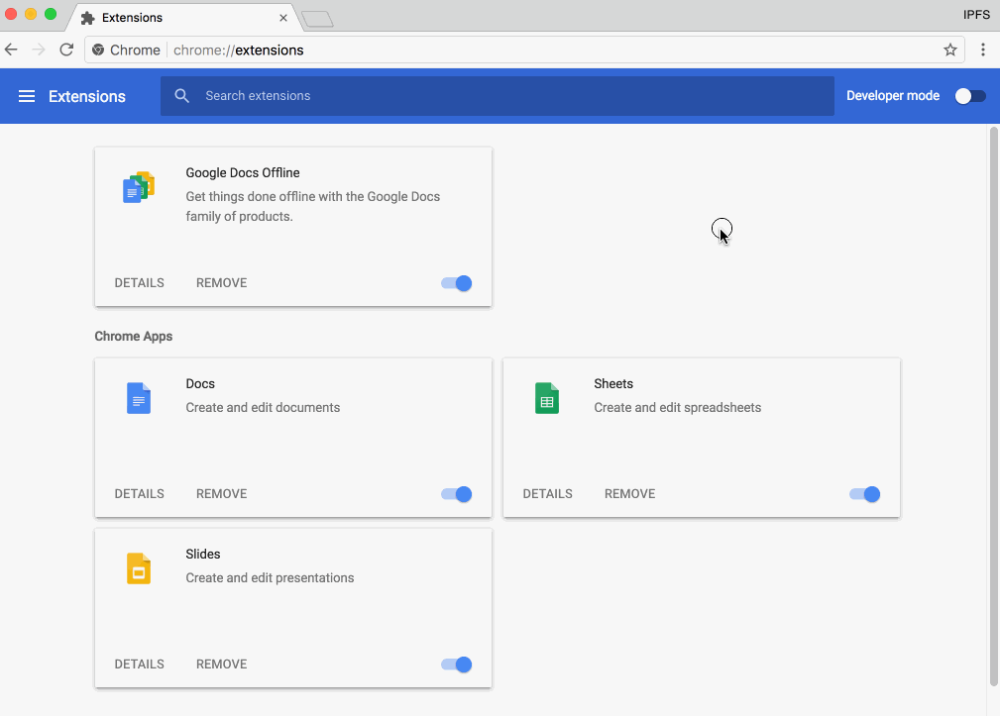
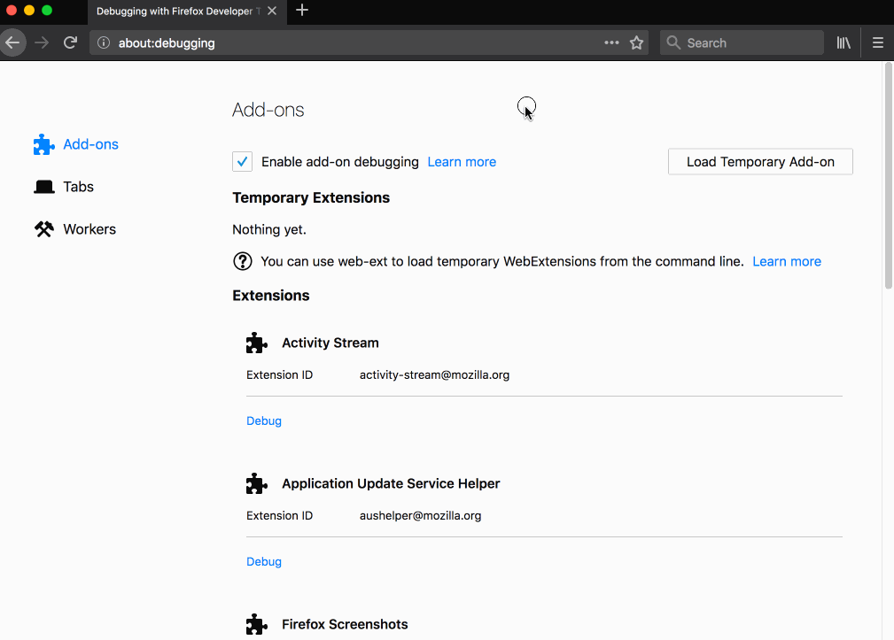

# IPFS Companion developer notes

If you're looking to develop on IPFS Companion, you should build the project from source.

## Build from source

You will need [NodeJS](https://nodejs.org/) and [Firefox](https://www.mozilla.org/en-US/firefox/developer/). Make sure `npm` and `firefox` are in your `PATH`. You can use `yarn` instead of `npm`. We provide `yarn.lock` if you choose to do so. This guide assumes you are using NPM.

1. Clone the [`ipfs-shipyard/ipfs-companion` repository](https://github.com/ipfs-shipyard/ipfs-companion):

   ```bash
   git clone https://github.com/ipfs-shipyard/ipfs-companion.git
   ```

2. Install all the project dependencies. This may take a few minutes:

   ```bash
   npm install

   > ...
   > added 4831 packages from 3074 contributors and audited 34257 packages in 265.081s
   ```

3. Build, test, and run the project in Firefox:

   ```bash
   npm start

   > ipfs-companion@ start /Users/oli/Desktop/ipfs-companion
   > run-s clean build test firefox
   > ...
   >
   ```

   If you run into issues, you can run each step manually to pinpoint where the process is failing:

   ```bash
   npm run build
   npm run test
   npm run firefox
   ```

   It is also possible to load the extension manually. Enter `about:debugging` in the URL bar, and then click "Load Temporary Add-on" and point it at `add-on/manifest.json`.

### Build and manual install in Chromium

1. Clone the repository:

   ```bash
   git clone https://github.com/ipfs-shipyard/ipfs-companion.git
   ```

2. Build the project:

   ```bash
   npm run build bundle:chromium

   > ipfs-companion@ build /Users/oli/Desktop/ipfs-companion
   > run-s clean build:* "bundle:chromium"
   > ...
   ```

3. Open [`chrome://extensions`](chrome://extensions) in your browser.
4. Enable **Developer mode**.
5. Click **Load unpacked extension...** and select the **add-on** folder within your project folder.

| Chrome "unpacked extension"                                                                                     | Firefox "temporary add-on"                                                                                     |
| --------------------------------------------------------------------------------------------------------------- | -------------------------------------------------------------------------------------------------------------- |
|  |  |

## Useful tasks

Each `npm` task can run separately, but most of the time, `dev-build`, `test`, and `fix:lint` are all you need.

- `npm install`: Install all NPM dependencies
- `npm run build`: Build the add-on (copy external libraries, create `.zip` bundles for Chrome and Firefox)
- `npm run bundle:chromium`: Overwrite manifest and package a generic, Chromium-compatible version
- `npm run bundle:brave`: Overwrite manifest and package a Brave-compatible version requesting access to `chrome.sockets`
- `npm run bundle:firefox`: Overwrite manifest and package a Firefox-compatible version
- `npm run build:rename-artifacts`: Rename artifacts to include runtimes in filenames
- `npm run ci`: Run tests and build (with frozen `yarn.lock`)
- `npm test`: Run the entire test suite
- `npm run lint`: Read-only check for potential syntax problems (run all linters)
- `npm run fix:lint`: Try to fix simple syntax problems (run `standard` with `--fix`, etc.)
- `npm run lint:standard`: Run [Standard](http://standardjs.com) linter ([IPFS JavaScript projects default to standard code style](https://github.com/ipfs/community/blob/master/CONTRIBUTING_JS.md))
- `npm run lint:web-ext`: Run [addons-linter](https://github.com/mozilla/addons-linter) shipped with `web-ext` tool
- `npm run firefox`: Run as temporary add-on in Firefox
- `npm run chromium`: Run as temporary add-on in Chromium
- `npm run get-firefox-nightly`: Fetch latest Firefox nightly build to `./firefox/`
- `npm run firefox:beta:add -- --update-link "https://host/path/to/file.xpi" file.xpi`: Add a manifest entry for new self-hosted beta for Firefox

Release build shortcuts:

- `npm run dev-build`: All-in-one: fast dependency install, build with yarn (updates yarn.lock if needed)
- `npm run beta-build`: Reproducible beta build in docker with frozen `yarn.lock`
- `npm run release-build`: Reproducible release build in docker with frozen `yarn.lock`

## Other tips

- You can switch to an alternative Firefox version by overriding your `PATH`:

  ```bash
  export PATH="/path/to/alternative/version/of/firefox/:${PATH}"
  ```

- [Using localization in IPFS Companion](companion-localization.md) (running browsers with specific locale, etc.)
- [Testing persistent and restart features (Mozilla)](https://developer.mozilla.org/en-US/Add-ons/WebExtensions/Testing_persistent_and_restart_features)
